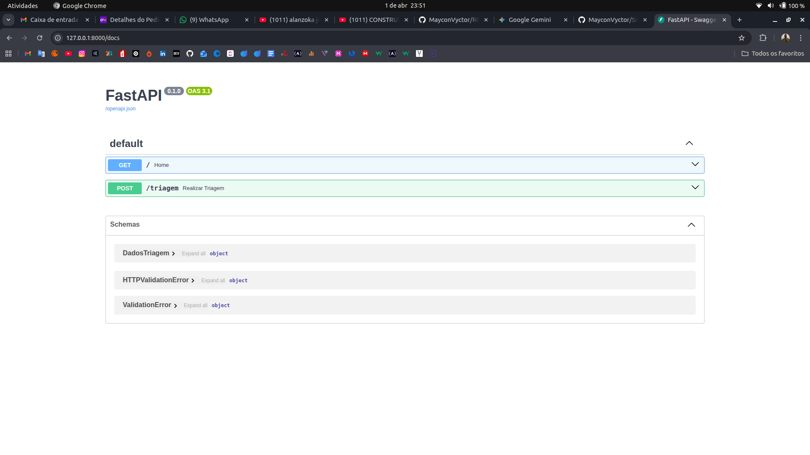

# 🤖 SmartInputAI - Triagem Inteligente de Suporte

O **SmartInputAI** é um motor de automação que utiliza Inteligência Artificial (Google Gemini) para processar textos não estruturados de suporte técnico, categorizá-los e armazená-los de forma organizada em um banco de dados relacional.

## 🚀 Tecnologias
- **Python 3.10+** (Core)
- **FastAPI/Pydantic** (Estruturação de dados)
- **PostgreSQL** (Armazenamento)
- **Docker & Docker Compose** (Ambiente isolado)
- **Google Gemini API** (Processamento de Linguagem Natural)

## 🌐 API Endpoints (FastAPI)

O projeto agora conta com uma interface de API documentada automaticamente pelo Swagger. 

### Como acessar:
1. Com o servidor rodando (`uvicorn main:app --reload`), acesse:
   [http://127.0.0.1:8000/docs](http://127.0.0.1:8000/docs)

### Demonstração:

---

### 🛠️ Novas Funcionalidades:
- **Endpoint POST `/triagem`**: Recebe um texto bruto e retorna a triagem processada pela IA.
- **Documentação Automática**: Interface interativa para testes rápidos de integração.
- **Servidor ASGI**: Preparado para conexões assíncronas com Frontend (React/Vue).

## 🛠️ Diferenciais Técnicos
- **Resiliência de API**: Implementação de lógica de *fallback* multi-modelo (Flash Lite, Pro, Latest).
- **Tratamento de Quota**: Gestão inteligente de erros 429 com `time.sleep` dinâmico baseado no cabeçalho da API.
- **Clean Architecture**: Separação clara entre modelos de dados, serviços de IA e persistência.

## 📦 Como Rodar
1. Clone o repositório.
2. Configure seu `.env` com a `GOOGLE_API_KEY`.
3. Suba o banco: `docker-compose up -d`.
4. Instale dependências: `pip install -r requirements.txt`.
5. Execute: `python3 main.py`.

/app
  /api       <- Rotas
  /models    <- Pydantic Schemas
  /services  <- Integração com IA
  /utils     <- Helpers e Loggers
main.py      <- Entrypoint